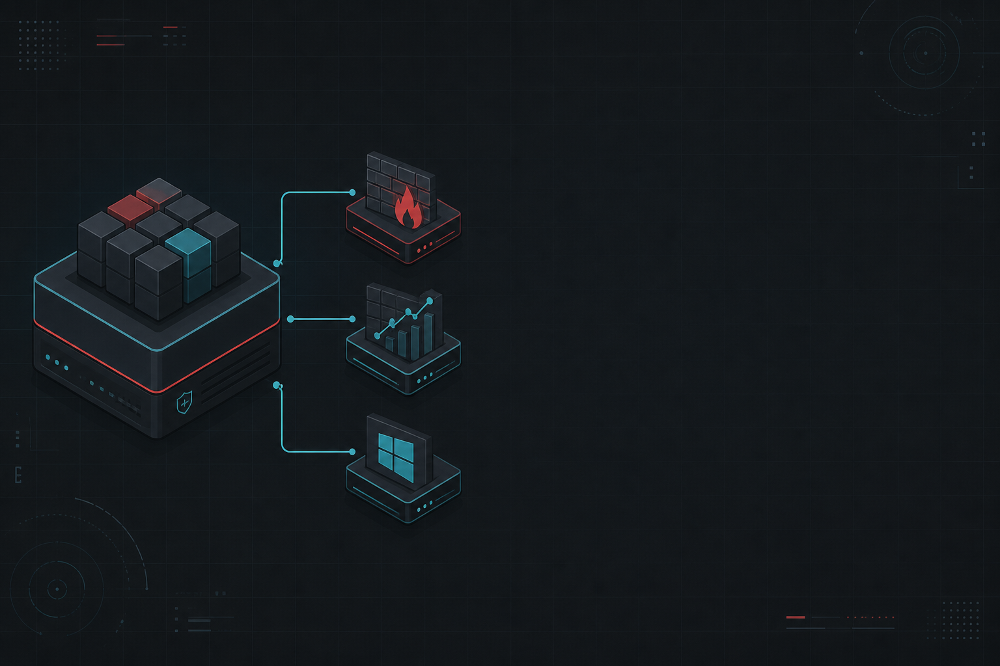
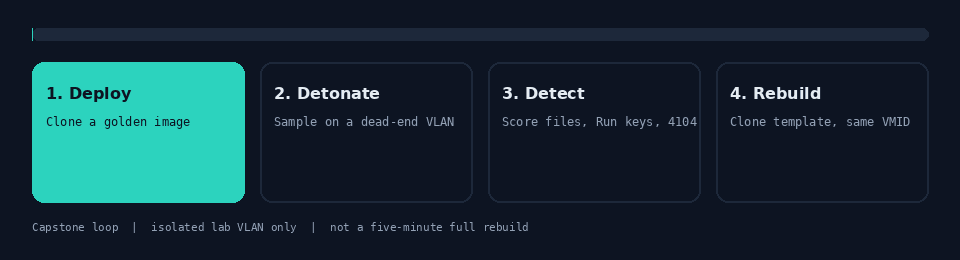
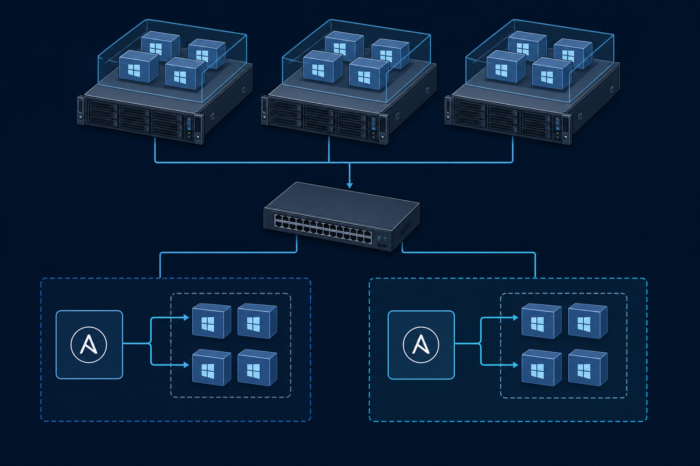
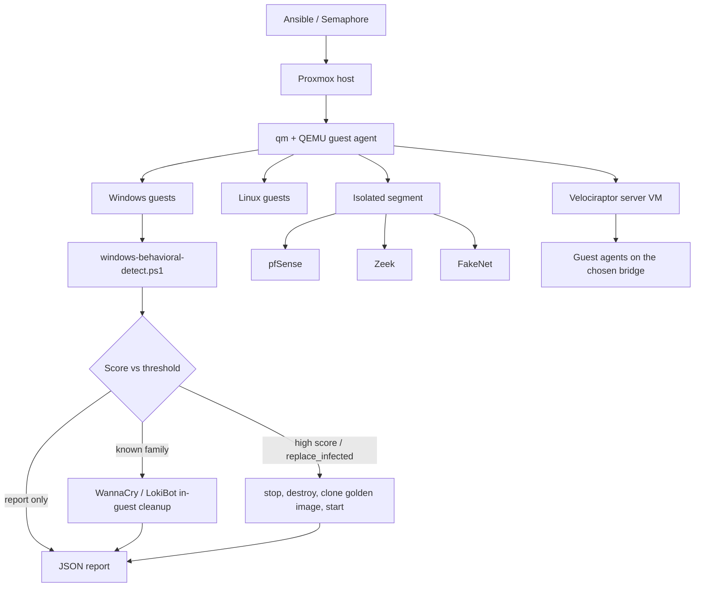

# Proxmox malware remediation lab



I am Andrei Gorlitsky. This is the public writeup of my Champlain College senior capstone: an isolated Proxmox lab that deploys Windows and Linux guests from golden images, detonates malware on a dead-end VLAN, scores Windows guests with a PowerShell behavioral detector through the QEMU guest agent, and then either cleans a known family in-guest or destroys the VM and clones the matching template back onto the same VMID.

It is a **team project**. Git history on the private class repo includes [Snowboundport37](https://github.com/Snowboundport37) (me), seraphim, seraphimgerber, and ConnorEast. I wrote a lot of the detection and remediation loop. I did not write every playbook. Ask me in person which files are mine.

This repository is documentation. It is not a clone-and-run lab. The private source stays in the class org until credentials are stripped from git history.

**Wiki (start here if you want the long form with a sidebar):** [github.com/Snowboundport37/capstone-stuff/wiki](https://github.com/Snowboundport37/capstone-stuff/wiki)


## Demo videos

Public team recordings, on [Connor East's playlist](https://www.youtube.com/playlist?list=PLPkOvo_i1rSDxZFL3YeICP31tdbLC-tmu):

- [Deploy student VMs script](https://www.youtube.com/watch?v=VHfKWpawOFY) (9:20)
- [Student VM removal script](https://www.youtube.com/watch?v=MjnJpV9ePZ0) (5:41)
- [Video evidence of usability](https://www.youtube.com/watch?v=q4kTlXVMoHI) (13:36)

The fourth clip was school-login only on YouTube. The 1080p copy is in this repo:

**[capstone demo, 1080p](docs/videos/capstone-demo-1080p.mp4)** (10:58, 1920x1080)


---

The loop, in one animation:



Deploy a clean guest. Detonate on an isolated segment. Detect from the hypervisor. Clean the family, or rebuild from the golden image. Write a JSON report. Repeat.

---

## What it does

- Deploys isolated Windows and Linux VMs on Proxmox VE from CIS-hardened golden templates.
- Confirms the QEMU guest agent is up before anyone tries to remediate.
- Runs `windows-behavioral-detect.ps1` inside Windows guests through `qm guest exec`. No RDP. No WinRM. No SSH into Windows.
- Scores file, persistence, process, and PowerShell Operational-log signals. Sets `likely_infected` when an internal threshold is hit.
- Optionally stops, destroys, and reclones a flagged VM onto the **same VMID** from a golden-image map.
- Family playbooks for WannaCry and LokiBot. Agent Tesla is sketched and thinner. I say so on that page.
- Collects host telemetry with Velociraptor, not Splunk.
- Hashes golden images and ASCII clones with SHA-256 so we can prove a template did not drift.

## What it is not

- **Not Splunk.** The collector in the tree is Velociraptor (`server.yaml`, `agents.yaml`).
- **Not Cuckoo Sandbox.** Detonation is a Proxmox VM on an isolated VLAN. FakeNet, Zeek, and pfSense sit on that segment. There is no Cuckoo pipeline.
- **Not YARA.** The detector is behavioral PowerShell plus an IOC list. Sigma/YARA would be a good next step. They are not what shipped.
- **Not a production EDR.** This is a teaching lab. The scoring is ours. The rebuild is a `qm` clone.
- **Not "detect to full lab rebuild under five minutes."** That number showed up on a resume draft. The code does not support it. WannaCry in-guest cleanup is typically 20–90 seconds once the guest agent is up. A detect-plus-rebuild is stop / destroy / clone / start, usually minutes per VM. The original proposal targeted **under 24–48 hours automated versus 3–5 days manual.** That is the honest comparison.
- **Not a dump of lab passwords, teammate hostnames, Semaphore URLs, or the live IP plan.** Those leaked into the private git history. That is why this repo is docs, not source.

If you opened the class wiki page [Complete Tools Documentation](https://github.com/Snowboundport37/capstone-stuff/wiki/Complete-Tools-Documentation), it lists Terraform, Pulumi, and a pile of other tools we researched. **What shipped is Ansible + Semaphore + Proxmox + QEMU guest agent + PowerShell + Velociraptor.** Treat that tools page as research notes, not the bill of materials.

---

## Architecture





Full writeup: [docs/architecture.md](docs/architecture.md). How a single run actually moves: [docs/playbooks.md](docs/playbooks.md) and the wiki page [How it works](https://github.com/Snowboundport37/capstone-stuff/wiki/How-it-works).

**Hypervisor.** Dell PowerEdge rack server running Proxmox VE. Isolated malware VLAN. No internet during detonation. The WAN-side bridge role is `vmbr3`. pfSense, Zeek, and FakeNet live on that segment.

**Orchestration.** Ansible playbooks, run from the CLI or from Semaphore. The remediator is the Proxmox node itself (inventory alias, not published). Guest work goes through QEMU guest agent, not SSH into Windows.

**Golden images.** Template VMIDs in the 3000 range. Example user clones ("ASCII" clones) mix those templates. Domain join is mentioned in the private README. There is no standalone Active Directory repo.

---

## How a run actually works

This is the path we used. It is not magic.

1. **Deploy.** A deployment playbook clones golden templates, sets CPU / RAM / NIC, and starts the guests. Several generations exist (`deployment1-benchmark`, `deployment1-remastered`, `deployment2`, a backup of `deployment2`, plus `singularVM-Deployment-MN.yaml`). They grew in the usual student-project way: first version that worked, then a rewrite, then another. I am not going to pretend they are one elegant module.
2. **Recon.** `QemuAgent_Online.yaml` asks whether the guest agent answers. `IP_collect.yaml` records guest addressing for the run. If QGA is down, remediation does not start. That check exists because we burned time talking to dead agents.
3. **Detonate.** Sample goes into an isolated Windows guest. No internet. FakeNet answers the obvious callbacks. Zeek watches the segment. Snapshots exist so a bad run is not the end of the afternoon.
4. **Detect.** `windows-behavioral-redeploy.yaml` pushes `windows-behavioral-detect.ps1` into the guest via QGA, scores the signals below, and writes a JSON report with a per-VM timeline.
5. **Either cleanup or rebuild.**
   - Known family, we want artifacts gone but the disk kept: `wannacry-remediation.yaml` or `lokibot-remediation.yaml` stages a PowerShell script and runs it as SYSTEM. Agent Tesla has the same shape and is thinner.
   - Unknown or we just want a clean box: if `replace_infected=true` and (`likely_infected` or `score >= detection_score_threshold`), the playbook stops the VM, destroys it, clones the matching golden template onto the **same VMID**, reapplies name / CPU / RAM / NIC, and starts it.
6. **Prove the template.** SHA-256 collection playbooks hash the base VMs and the ASCII clones. Results land in `vm-hashes/*.json`. That is how we argue the golden image did not drift between runs.
7. **Tear down when we are done.** Removal scripts destroy lab VMs by pool or VMID range. Do not point those at anything that is not this lab.

Typical timing, once QGA is up:

| Step | Honest number |
| --- | --- |
| WannaCry in-guest cleanup | 20–90 seconds. Heavier guests: a few minutes. |
| Detect + rebuild one VM | Minutes. Stop, destroy, clone, start. Not five minutes for the whole lab. |
| Proposal target | Under 24–48 hours automated vs 3–5 days of manual artifact chasing. |

Private README metric: sub-48-hour automated versus multi-day manual. That is the claim I will defend.

---

## Lab roster

Roles and template VMIDs only. Live addresses, teammate hostnames, and the IP plan stay out of this repo. Full role notes: [docs/inventories.md](docs/inventories.md).

| Role | Template VMID | Why it exists |
| --- | ---: | --- |
| `fakenet` | 3000 | Fake network services on the detonation segment so malware has something to talk to that is not the internet. |
| `win10` | 3001 | Default Windows 10 golden image. Fallback rebuild target. |
| `win11` | 3002 | Windows 11 golden image. Rebuild map: win11 guests → 3002. |
| `winsrv` | 3003 | Windows Server golden image. Rebuild map: server guests → 3003. |
| `ubusrv` | 3004 | Ubuntu server. Linux services, Velociraptor server candidate. |
| `ubu` | 3005 | Ubuntu workstation-style guest. |
| `rocky` | 3006 | Rocky Linux. Second Linux baseline. |
| `kali` | 3007 | Offensive tooling guest, still on the isolated side. |
| `vyos` | 3008 | Routing / lab WAN edge. |
| `pfsense` | 3009 | Firewall on the isolated segment. |
| `vyos-gw` | 3010 | Gateway role, separate from the generic VyOS template. |
| `vyos-dhcp` | 3011 | DHCP for the lab segment. |
| `zeek` | 3012 | Network monitoring on the malware VLAN. |
| `malware` | 3013 | Dedicated detonation profile. Rebuild map: malware guests → 3013. |

WAN-side bridge role: `vmbr3`. Example user VMs are mixed-template clones we called ASCII clones. They are hashed separately from the base templates.

Inventories that exist in the private tree, documented by filename only:

- `inventories/hosts` — remediator and group roles. Contents are not published.
- `inventories/base-vms.ini` — golden templates by role. Contents are not published.

---

## Playbook catalog

Private tree path: `playbooks/proxHost/`. One-paragraph explanations live in [docs/playbooks.md](docs/playbooks.md). Short map:

| Area | Filenames | What they are for |
| --- | --- | --- |
| Sanity | `ping_test.yml` | Ansible can talk to the remediator. First thing we ran in Semaphore. |
| Deploy | `deployment1-benchmark`, `deployment1-remastered`, `deployment2`, `deployment2_backup`, `nonProd-Scripts`, `singularVM-Deployment-MN.yaml` | Clone templates, set resources, start VMs. Several generations. |
| Tear down | `removal_scripts` | Destroy lab VMs by pool or range. |
| Integrity | `asciiVMs-sha256Collection.yaml`, `baseVMs-Sha256Collection.yaml`, `vm-hashes/*.json` | SHA-256 of golden images and ASCII clones. |
| Recon | `IP_collect.yaml`, `QemuAgent_Online.yaml` | Guest addressing and "is QGA actually up." |
| Detect / rebuild | `windows-behavioral-redeploy.yaml`, `windows-behavioral-detect.ps1` | Score the guest. Optionally clone the golden image back onto the same VMID. |
| Families | `wannacry-remediation.yaml`, `lokibot-remediation.yaml`, `agenttesla-remediation.yaml` plus the matching `*-remediate.ps1` files | In-guest cleanup. Agent Tesla is the thin one. |
| Staging | `guest_stage_and_remediate.py` | Chunks a PowerShell script into the guest through QGA. |
| IOCs | `iocs.json` | Hashes and artifact names. Hashes are discussable. Binaries are not published. |
| Older scans | `remediation/2`, `remediation/3` (`scan.yml`, `per_vm_scan.yml`) | Earlier scan copies. Kept because that is how the tree grew. |
| Reports | `remediation-reports/wannacry-report.json` | Shape of a run report. Live host data is not pasted here. |
| Collector | `siem/server.yaml`, `siem/agents.yaml` | Velociraptor server and guest agents. |

I did not author every file in that table. Deployment generations in particular are team work.

---

## Detector scoring, in plain English

Playbook: `windows-behavioral-redeploy.yaml`
Script: `windows-behavioral-detect.ps1`

The script runs **inside** the Windows guest. Lookback is measured in hours. It does not try to be a full AV engine. It looks for the kind of mess a lab detonation leaves behind.

**Signals**

- Hash-like or random filenames under Public, Downloads, ProgramData, and Temp.
- Keyword filenames: `update`, `invoice`, `payload`, `wallet`, and similar bait.
- HKLM / HKCU `Run` and `RunOnce`, especially command paths under AppData, Temp, powershell, or bitsadmin.
- High CPU-seconds or memory on processes that are not on a small allowlist.
- PowerShell Operational event 4104 bursts, plus patterns such as `iwr`, `DownloadString`, `FromBase64String`, `reg add`, `bitsadmin`.

**Scoring example we actually observed:** `hashFiles.Count >= 3` adds **+30**. Other signals add their own weights. `likely_infected` flips when the internal threshold is hit. The playbook can also fire on `score >= detection_score_threshold` even if that flag is off, which is why both knobs exist.

**Rebuild map** (name / ostype inference, then fallback):

| Guest looks like | Clone from template |
| --- | ---: |
| win11 | 3002 |
| server | 3003 |
| malware | 3013 |
| anything else Windows | 3001 (win10) |

Override map per VMID beats inference. Fallback default is 3001.

**Knobs**

- `replace_infected` — if false, detect and report only.
- `detection_score_threshold` — playbook-side score gate.
- Optional script-block, module, and transcription logging during the run.

**Report.** JSON, per VM: identity, score, `likely_infected`, reasons, whether redeploy ran, timestamps for scan / detect / destroy / clone / finish, and `qm` result codes. Sample output is not checked into this public repo yet. That is a gap. I would put redacted JSON under `samples/` if I did this again.

More: [docs/detection.md](docs/detection.md).

Placeholder shape only (does not hit our lab):

```bash
# detect only
ansible-playbook -i inventories/hosts.example \
  playbooks/proxHost/remediation/windows-behavioral-redeploy.yaml \
  -e "remediator_host=proxmox scan_vmids=[2004,2005] replace_infected=false"

# detect and rebuild
ansible-playbook -i inventories/hosts.example \
  playbooks/proxHost/remediation/windows-behavioral-redeploy.yaml \
  -e "remediator_host=proxmox vmid_range_start=2000 vmid_range_end=2100 replace_infected=true"
```

Do not point this at a machine that is not an isolated lab VM.

---

## Family remediations

These are defensive lab cleanups for the families we detonated. They are not generic products. They are not a guide for infecting anything.

### WannaCry

[docs/wannacry.md](docs/wannacry.md)

Files: `wannacry-remediation.yaml`, `guest_stage_and_remediate.py`, `wannacry-remediate.ps1`, `iocs.json`.

Kills `tasksche`, `mssecsvc`, `taskdl`, `taskse`, `WanaDecryptor`. Removes service `mssecsvc2.0`. Deletes `@WanaDecryptor@`, `@Please_Read_Me@.txt`, `*.wnry`, `*.wncry`. Modes: Audit / Contain / Remediate / ReportOnly. Typical in-guest runtime 20–90 seconds. That is cleanup time, not detect-to-rebuild.

### LokiBot

[docs/lokibot.md](docs/lokibot.md)

Files: `lokibot-remediation.yaml`, `lokibot-remediate.ps1`, same staging helper.

Looks at process/path indicators `loki`, `Downloads\Loki`, `AppData\Roaming\Loki`, `fre.php`. Keeps `.pcap` files on purpose. Cleans Loki-specific scheduled tasks. Optional C2 firewall blocks if a list is provided. Exit code 0 only on `VERIFICATION RESULT: PASSED`.

### Agent Tesla

[docs/agent-tesla.md](docs/agent-tesla.md)

Files: `agenttesla-remediation.yaml`, `agenttesla-remediate.ps1`.

Sketched. Same QGA-stage-and-run shape as the other two. Thinner coverage, thinner verification, thinner testing. I am not going to dress it up as equal to WannaCry or LokiBot.

---

## Velociraptor, not Splunk

[docs/siem.md](docs/siem.md)

The private tree has `playbooks/proxHost/siem/server.yaml` and `agents.yaml`. That is a Velociraptor server VM plus agents pushed onto guests on a chosen bridge. It is the collector. It is not a Splunk app. It is not a replacement for the PowerShell detector. The detector still does the scoring that can trigger a rebuild. Velociraptor is how we pull more telemetry off the guests after the fact.

Proposal language talked about SIEM in general. Early research notes mentioned Splunk. The files that exist are Velociraptor.

---

## Integrity hashing

[docs/integrity.md](docs/integrity.md)

- `baseVMs-Sha256Collection.yaml` hashes the golden templates.
- `asciiVMs-sha256Collection.yaml` hashes the example user clones.
- Output: `vm-hashes/*.json`.

If a template hash moves and nobody meant to rebuild that template, the golden image drifted. That is the whole point of the playbooks. We used them to argue a restore came from a known-good disk, not from last Tuesday's infected clone.

---

## What is public vs still private

| Public (this repo + wiki) | Still private |
| --- | --- |
| Architecture, scoring, family writeups, playbook catalog, roster of roles and template VMIDs | Ansible source, inventories with real addresses, Semaphore project, Proxmox API settings |
| Honest tool names | Lab passwords, Velociraptor admin password, `credentials.yaml` |
| IOC *names* and the idea of `iocs.json` | Malware binaries, chain-of-custody notes, live report host data |
| Original proposal (as submitted) | Teammate hostnames, live IP plan, VPN endpoints |

Why private stays private: secrets went into git. Inventories, playbooks, and the Velociraptor server file all had passwords at some point. Rotating those is a separate job from writing docs. Publishing the private history as-is would be a credential leak, not a portfolio.

This public tree is not a sanitized fork of the playbooks. It is the writeup. If I publish example inventories later, they will be placeholders with documentation addresses, vaulted secrets, and no teammate names.

---

## Team

Champlain College, B.S. Computer Networking & Cybersecurity, May 2026.

Private repo authors, in git history:

- **Snowboundport37** — me, Andrei Gorlitsky
- **seraphim**
- **seraphimgerber**
- **ConnorEast**

I was one of the two people who committed the most. That is not the same as "I built the lab alone." Deployment playbooks, inventories, Semaphore wiring, and several of the network VMs are team work. Detection scoring, the rebuild loop, and the family remediation writeups are the parts I can walk through cold. If a hiring manager wants a file-by-file split, ask. I will not invent one here to look better.

---

## What I would change

- **Vault from day one.** Hardcoding lab passwords in inventory was a mistake. It is why this repo cannot ship the playbooks.
- **Sigma / YARA next to the PowerShell detector** so the logic is portable off Proxmox. Not because I want to pretend we had YARA. Because the current detector dies when QGA dies.
- **Checked-in sample detector JSON** under `samples/`, redacted. Right now I can describe the fields and I cannot show you a file.
- **One deployment playbook, not four generations.** `deployment1-benchmark` through `deployment2_backup` is a history of us learning Proxmox clones, not a design.
- **Finish Agent Tesla** or delete it from the story. A sketched third family is worse than two solid ones.
- **Do not put a five-minute number on a rebuild.** Measure it. Write the JSON timeline down. Use that.

---

## Docs in this repo

- [Architecture](docs/architecture.md)
- [How detection scores and when a VM is rebuilt](docs/detection.md)
- [Playbook catalog](docs/playbooks.md)
- [Inventory roles](docs/inventories.md)
- [Golden-image integrity hashing](docs/integrity.md)
- [Velociraptor collector](docs/siem.md)
- [WannaCry remediation](docs/wannacry.md)
- [LokiBot remediation](docs/lokibot.md)
- [Agent Tesla (sketched)](docs/agent-tesla.md)
- [Original proposal](docs/proposal.md) — left as submitted. For what we actually built, you are already on that page.

## Wiki

Long hub, same facts, sidebar navigation:

https://github.com/Snowboundport37/capstone-stuff/wiki

Profile: [github.com/Snowboundport37](https://github.com/Snowboundport37)
