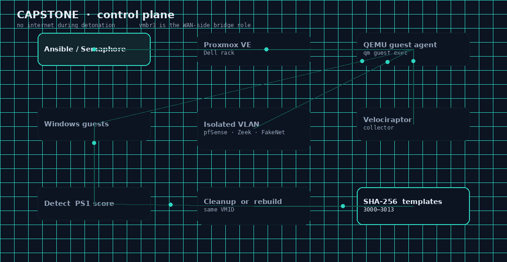
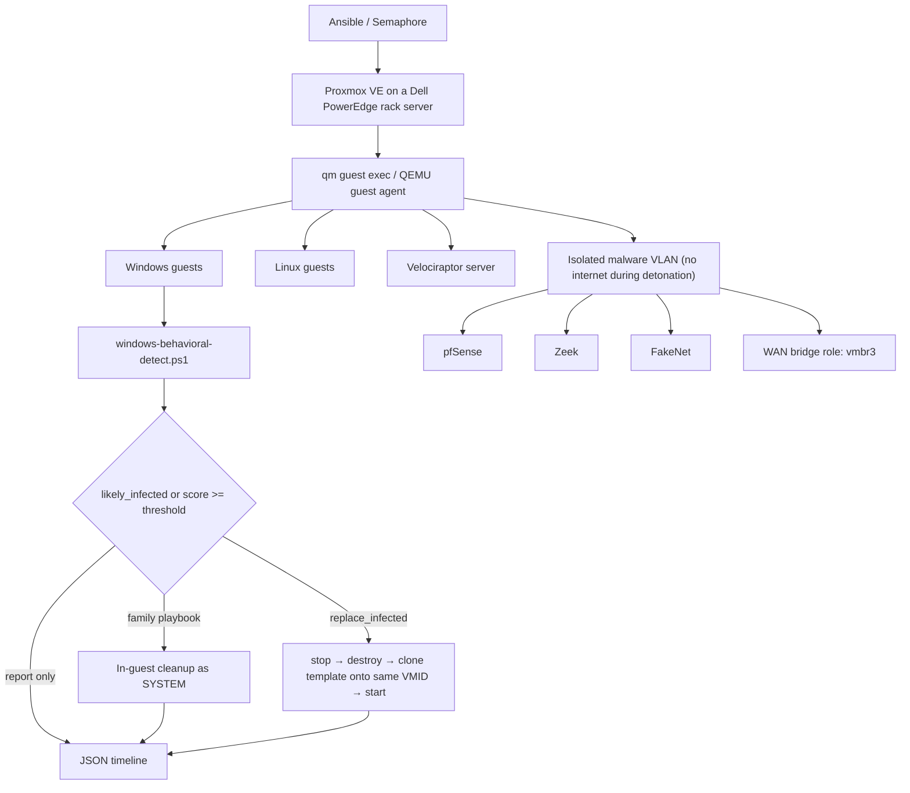

# Capstone architecture

This is the system that exists in the private tree, written so a stranger can follow it without lab passwords, teammate hostnames, or the live IP plan.

I am one of the authors. Deployment, inventories, and a chunk of the network VMs are team work ([Snowboundport37](https://github.com/Snowboundport37), seraphim, seraphimgerber, ConnorEast). I can walk the detection and rebuild path without notes. I will not claim every YAML file.

For the original proposal (Splunk-flavored SIEM language, Dell model number, FOG imaging, sub-48-hour MTTR), see [proposal.md](proposal.md). For what shipped, stay here.





## Pieces

**Hypervisor.** Proxmox VE on a Dell PowerEdge rack server. The proposal said R340. Later lab notes said R430. I am not going to pick a fight with the asset tag in public. It is a Dell rack server running Proxmox. Golden templates live in VMID 3000–3013. See [inventories.md](inventories.md).

**Network.** Isolated malware VLAN. No internet during detonation. pfSense on the segment. Zeek watching. FakeNet answering the dumb callbacks so the sample has somewhere to go that is not a real C2. WAN-side bridge role is `vmbr3`. Addressing stays private because the live plan was committed to git.

**Orchestration.** Ansible. Run from the CLI or from Semaphore. Semaphore is a web UI in front of the same playbooks. I am not publishing the URL, the login, or the project name. The remediator host is the Proxmox node (inventory alias). All Windows guest work goes through `qm guest exec`, not SSH, not WinRM, not RDP.

**Detection.** `windows-behavioral-detect.ps1` inside the guest. JSON back to `windows-behavioral-redeploy.yaml`. Scoring is documented in [detection.md](detection.md).

**Containment / rebuild.** If score crosses threshold and `replace_infected=true`, the playbook stops the VM, destroys it, clones the matching golden template onto the **same VMID**, reapplies name / CPU / RAM / NIC, starts it. Same VMID matters: inventory, Velociraptor agent targeting, and our own notes keep pointing at a number. We did not want that number to become a hole after a rebuild.

**Family cleanup.** WannaCry and LokiBot playbooks stage a PowerShell script into the guest (`guest_stage_and_remediate.py`) and run it as SYSTEM. Used when we want artifact removal instead of a full rebuild. Agent Tesla has the same skeleton and less meat. See [wannacry.md](wannacry.md), [lokibot.md](lokibot.md), [agent-tesla.md](agent-tesla.md).

**Collector.** Velociraptor server in a Linux VM, agents pushed to guests on a chosen bridge. Files: `siem/server.yaml`, `siem/agents.yaml`. Not Splunk. [siem.md](siem.md).

**Integrity.** SHA-256 collection against base templates and ASCII clones. [integrity.md](integrity.md).

## Golden image selection

In order, inside `windows-behavioral-redeploy.yaml`:

1. Per-VMID override map, if we set one.
2. Inferred from VM name / ostype:
   - win11 → template **3002**
   - server → template **3003**
   - malware profile → template **3013**
   - default Windows → template **3001**
3. Fallback default template VMID (3001).

Linux guests are not scored by the PowerShell detector. They still get cloned from their own templates during deployment. Rebuilding a Linux box from this particular playbook is not the path we used.

## Why QEMU guest agent and not WinRM

WinRM into a detonated Windows guest is a nice way to argue with ransomware about whether it still wants to talk XML. QGA rides the hypervisor channel. If the guest is up enough to run the agent, we can copy a script in and run it as SYSTEM without opening a management port on the malware VLAN. If QGA is down, the recon playbook `QemuAgent_Online.yaml` fails first and we do not pretend a remediation ran.

That is also a limitation. A sample that kills the guest agent, or a guest that never got the agent installed, is a manual problem. The detector is not a kernel driver.

## Data that moves

```
Semaphore / ansible-playbook
        |
        v
  remediator (Proxmox node)
        |
        +-- qm guest exec --> detector / family script
        +-- qm stop/destroy/clone/start --> rebuild
        +-- sha256 collection --> vm-hashes/*.json
        +-- JSON report --> remediator filesystem
```

Reports land on the remediator under a timestamped JSON filename. `remediation-reports/wannacry-report.json` exists in the private tree as a run artifact. I am not pasting live host data from it.

## What this is not, architecturally

- There is no Splunk indexer, no heavy forwarder, no Cuckoo dispatcher, no YARA scan step.
- Terraform and Pulumi appear on the class [tools research page](https://github.com/Snowboundport37/capstone-stuff/wiki/Complete-Tools-Documentation). They did not provision this lab. Ansible did.
- Early progress reports mention ChatMock and n8n. Those were integration experiments. They are not in the remediation loop above.
- Domain join is mentioned in the private README. There is no separate AD automation repo in what we shipped.

## What I would change

Vault for secrets from day one. A public sanitized example inventory, not the live one. Sigma/YARA next to the PowerShell detector so the logic survives off this hypervisor. One deployment playbook instead of four generations. A diagram that includes failure cases (QGA down, clone fails, hash mismatch) instead of only the happy path.

The physical rack and how we stood it up: [homelab.md](homelab.md).
