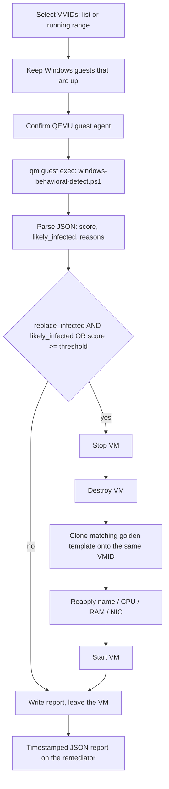

# Behavioral detection and golden-image rebuild

Playbook: `windows-behavioral-redeploy.yaml`
Detector: `windows-behavioral-detect.ps1` (runs in the guest via QEMU guest agent)

This is the part of the capstone I can defend in an interview without flipping through YAML. Teammates built a lot of the deploy side. The scoring loop and the "clone the golden image back onto the same VMID" behavior live here.

It is not Splunk. It is not YARA. It is not an EDR product. It is a PowerShell script with a lookback window and a score, plus an Ansible playbook that is willing to destroy a VM.


## Flow



1. Select VMIDs. Explicit list (`scan_vmids`) or running VMs in a range (`vmid_range_start` / `vmid_range_end`).
2. Keep Windows guests that are actually up. Linux is not this detector's problem.
3. Run the detector inside each guest through QGA.
4. Score signals. Set `likely_infected` if the internal threshold is hit.
5. If `replace_infected=true` **and** (`likely_infected` **or** `score >= detection_score_threshold`):
   - stop
   - destroy
   - clone golden image to the same VMID
   - restore basic settings
   - start
6. Write a JSON report with a per-VM timeline.

If QGA is down, stop. `QemuAgent_Online.yaml` exists for a reason. A failed guest-exec is not a clean bill of health.

## Signals

Lookback is in hours. The script looks where lab detonations actually drop junk.

**Hash-like / random filenames.** Public, Downloads, ProgramData, Temp. A pile of files named like hashes is a cheap tell. It is also how a lot of stealers and droppers show up after a run.

**Keyword files.** Names that include bait we kept seeing: `update`, `invoice`, `payload`, `wallet`, and similar. This is not a reputation engine. It is a word list with a recency window.

**Autorun persistence.** HKLM and HKCU `Run` and `RunOnce`. Extra weight when the command path sits under AppData, Temp, powershell, or bitsadmin. That is the persistence we actually cleaned in the family scripts, so the detector looks for the same neighborhood.

**Resource abuse.** High CPU-seconds or memory on processes that are not on a small allowlist. This one is noisy. A compile, a browser, or a scan can look "high." It is a contributing signal, not a one-hit convict.

**PowerShell Operational 4104 burst.** Volume plus patterns: `iwr`, `DownloadString`, `FromBase64String`, `reg add`, `bitsadmin`. Optional: turn on script-block, module, and transcription logging during the run so the next 4104s are actually useful.

The detector does not unpack malware. It does not emulate. It does not fetch anything from the internet. Isolated VLAN, remember.

## Scoring, the part people skip

Each signal group contributes points. `likely_infected` is a boolean the script sets when its own internal threshold is crossed. The playbook has a second gate, `detection_score_threshold`, so we can rebuild on a high score even if the internal flag did not flip, or refuse to rebuild when we only wanted a report.

**Example we observed:** `hashFiles.Count >= 3` → **+30**.

That one line is doing a lot of work in a detonation lab. Three recent hash-named files in the watched directories is not how a clean golden image looks. It is how a dropper looks after it unpacked. I am not going to publish a full weight table I would then have to keep in sync with a private script. The public facts are:

- hash-like file count is a heavy hitter; three or more was worth +30 on the runs we watched
- persistence paths under AppData/Temp/powershell/bitsadmin are treated as more serious than a random Run key
- 4104 bursts with download / decode / `reg add` patterns add up fast
- allowlisted processes do not get the CPU/memory penalty
- `likely_infected` is the script's own call; the playbook can be stricter or looser with `detection_score_threshold`

False positives happen. That is why `replace_infected` defaults to a human decision at run time, not "always nuke." Report-only mode exists so we can read the JSON and argue with the score before we destroy a disk.

## Redeploy trigger

Both must be true:

- `replace_infected=true`
- detector `likely_infected=true` **or** `score >= detection_score_threshold`

Rebuild map, after any per-VMID override:

| Guest looks like | Golden template VMID |
| --- | ---: |
| win11 | 3002 |
| Windows Server | 3003 |
| malware profile | 3013 |
| default Windows | 3001 |

Same VMID after clone. Same name, CPU, RAM, NIC as far as the playbook restores them. This is not a full config-management converge. If we had customized the guest after first boot and did not bake that into the template, a rebuild wipes it. That is the point of a golden image, and also the reason the templates have to stay hashed ([integrity.md](integrity.md)).

## Report fields (per VM)

- VM identity (VMID, name)
- score
- `likely_infected`
- reasons (which signal groups fired)
- whether redeploy ran
- timestamps: scan / detect / destroy / clone / finish
- `qm` result codes

Reports land on the remediator host under a timestamped JSON filename. Sample output is not checked into this public repo. That is a gap. `remediation-reports/wannacry-report.json` in the private tree is a family-cleanup report, not a detector sample, and I am not pasting live host rows out of it.

## Timing, without the resume inflation

- Detector runtime: seconds to a small number of minutes per guest, depending on lookback and how loud the event log is.
- Rebuild: stop + destroy + clone + start. **Minutes per VM**, once QGA has already answered. Not "the whole lab in five minutes."
- Proposal comparison: automated path measured in hours to a couple of days versus 3–5 days of manual artifact chasing. Private README: sub-48-hour automated versus multi-day manual.

If someone quotes five minutes, they are mixing up WannaCry's 20–90 second in-guest cleanup with a full rebuild. Those are different jobs. See [wannacry.md](wannacry.md).

## Example (placeholders)

These point at example inventory and example VMIDs. They do not hit our lab.

Detect only:

```bash
ansible-playbook -i inventories/hosts.example playbooks/proxHost/remediation/windows-behavioral-redeploy.yaml \
  -e "remediator_host=proxmox scan_vmids=[2004,2005] replace_infected=false"
```

Detect and rebuild:

```bash
ansible-playbook -i inventories/hosts.example playbooks/proxHost/remediation/windows-behavioral-redeploy.yaml \
  -e "remediator_host=proxmox vmid_range_start=2000 vmid_range_end=2100 replace_infected=true"
```

Do not point this at a host that is not an isolated lab VM.

## What I would change

Publish a redacted `samples/detector-report.json`. Split "score this guest" from "destroy this guest" so a bad extra-var cannot take down a range. Add Sigma rules that describe the same 4104 patterns, even if the lab still executes PowerShell. Measure rebuild time from the JSON timestamps and put that number in this file instead of an adjective.
