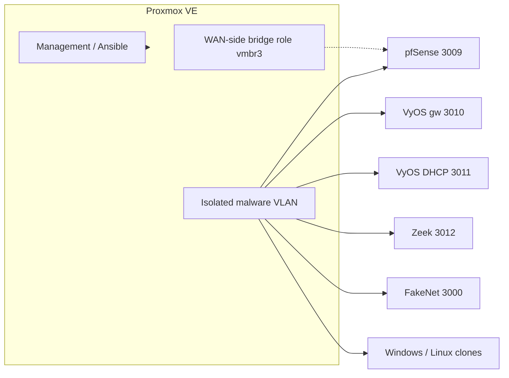

# Homelab: Proxmox malware lab on a Dell rack

This is not a second project I invented for the GitHub profile. The homelab **is** the Champlain capstone rack. Same hypervisor, same golden images, same isolated VLAN. The public writeup lives in this repo. The private class git stays private because passwords landed in history.

Team: Snowboundport37 (me), seraphim, seraphimgerber, ConnorEast. I can walk detection, rebuild, and the family scripts without notes. Deployment generations, inventories, and several network VMs are team work.

No live IPs, no lab passwords, no teammate hostnames.

---

## What sits on the floor

Dell PowerEdge rack server running Proxmox VE. Proposal said R340. Later notes said R430. I am not going to pick a fight with the asset tag in public. It is a Dell rack box, not three mystery nodes I never photographed.

On top of that hypervisor:

- Golden templates in VMID **3000–3013** (see [inventories.md](inventories.md))
- Running clones for detonation, Linux utilities, and the network appliances
- Ansible / Semaphore talking to the Proxmox node as the remediator
- Velociraptor as the collector, not Splunk

That is the homelab. Everything below is how we actually used it, not a hypothetical "enterprise homelab" blog post.

---

## How the network is built (the security part)

The point of this rack is **containment**, not "I run a bunch of VMs at home."

**Rules we actually ran with:**

1. **No internet during detonation.** Samples do not get a default route to the real world. FakeNet (template 3000) answers the dumb callbacks so the malware has something to talk to. Zeek (3012) watches the segment. pfSense (3009) is the firewall on that island.
2. **WAN-side traffic, when it exists, is a named bridge role (`vmbr3`), not "the same vSwitch as the infected guests."** Management Ansible / `qm` stays on the hypervisor channel. We do not open WinRM or RDP on the malware VLAN to "just quickly check."
3. **Guest work is QEMU guest agent.** `qm guest exec` from the remediator. If QGA is down, `QemuAgent_Online.yaml` fails first and we do not pretend a cleanup ran. A sample that kills the guest agent is a manual problem. The detector is not a kernel driver.
4. **Network appliances are not detonation targets.** You do not drop WannaCry on the pfSense box. Windows clones are what `windows-behavioral-redeploy.yaml` iterates.
5. **Snapshots exist** so a bad afternoon is not a reimage of the whole template set.

Live RFC1918 addressing stays out of this file. The plan was committed to private git. That is a mistake I already admitted, not a diagram I am going to paste.

---

## How I treat Proxmox as a control plane

Most "homelab Proxmox" writeups stop at "I installed it and cloned Ubuntu." This lab uses Proxmox as the **thing that puts the machine back**.

| Control | How it works here |
| --- | --- |
| Golden image | Templates 3000–3013. CIS-hardened (or at least "this is the clean disk"). |
| Identity after rebuild | Clone back onto the **same VMID**. Inventory, notes, and Velociraptor targeting keep pointing at a number. We did not want that number to become a hole. |
| Prove the template | `baseVMs-Sha256Collection.yaml` and `asciiVMs-sha256Collection.yaml`. If a template hash moves and nobody meant to rebuild it, the golden image drifted. |
| Detect | `windows-behavioral-detect.ps1` inside the guest, scored from the hypervisor playbook. |
| Contain | Family cleanup (WannaCry, LokiBot) as SYSTEM, **or** stop / destroy / clone / start. |
| Don't nuke by accident | `replace_infected=false` is detect-and-report. Both knobs exist because a bad extra-var should not wipe a range. |
| Orchestration | Ansible from CLI or Semaphore. Same playbooks. Semaphore URL is not public. |

Rebuild map (name / ostype, then fallback):

| Guest looks like | Clone from |
| --- | ---: |
| win11 | 3002 |
| server | 3003 |
| malware profile | 3013 |
| other Windows | 3001 |

Per-VMID override beats inference. Linux guests are not scored by the PowerShell detector.

Full loop: [architecture.md](architecture.md), [detection.md](detection.md).

---

## How a run is supposed to go

This is the path we used, not a marketing funnel.

1. **Deploy.** Clone templates, set CPU / RAM / NIC, start. Several deployment YAML generations exist because we learned Proxmox clones in public. I am not going to collapse them into one elegant module after the fact.
2. **Recon.** Is QGA up. What address did the guest get. If the agent is dead, stop.
3. **Detonate.** Sample into an isolated Windows guest. No internet. FakeNet + Zeek. Snapshot first.
4. **Detect.** Push the PowerShell detector through QGA. JSON report with score, `likely_infected`, reasons, timestamps.
5. **Cleanup or rebuild.** Known family: in-guest script as SYSTEM. Unknown / we want a clean disk: destroy and clone the matching template onto the same VMID, reapply name / CPU / RAM / NIC, start.
6. **Hash.** Templates and ASCII clones. Argue the restore came from a known-good disk.
7. **Tear down.** Removal scripts by pool or VMID range. Do not point those at anything that is not this lab.

Honest timing, once QGA is up: WannaCry in-guest cleanup 20–90 seconds. Detect-plus-rebuild is minutes per VM (stop / destroy / clone / start). Proposal target was under 24–48 hours automated versus 3–5 days of manual artifact chasing. Not "the whole lab in five minutes."

Families we actually wrote playbooks for: **WannaCry**, **LokiBot**, and a thinner **Agent Tesla** skeleton. I am not adding LockBit, Raspberry Robin, or njRAT to this page because those are not in the tree.

---

## How I actually stood the hypervisor up

Condensed, no secrets, in the order a second person would redo it:

1. Rack the Dell. Proxmox VE on the metal. Management NIC off the detonation segment.
2. Create Linux bridges. Name the WAN-side role `vmbr3`. Create the isolated malware VLAN as its own bridge / VLAN tag. Do not give that bridge a gateway to the house internet.
3. Install golden templates from known-good ISOs. Hardening pass (CIS-ish: disable junk services, guest agent on, no extra management ports). Convert to template. Stamp VMIDs 3000–3013 so the rebuild map is boring and stable.
4. Clone pfSense, VyOS gw, VyOS DHCP, Zeek, FakeNet onto the isolated segment. Confirm they cannot hairpin to management.
5. Point Ansible at the Proxmox node (remediator). First playbook that should work: `ping_test.yml`. Then `QemuAgent_Online.yaml`. If those fail, nothing else is real.
6. Semaphore in front of the same inventory when we got tired of CLI. Same YAML. Not a second source of truth.
7. Velociraptor server on a Linux VM, agents on a chosen bridge. Collector only. Scoring still lives in the PowerShell detector.
8. Hash the templates before the first detonation. Hash them again after a rebuild. Keep the JSON.

That is the "how I did it." The playbook names are in [playbooks.md](playbooks.md). Sanitized snapshot of the tree is in this repo under `playbooks/` and `inventories/` with documentation addresses (`10.10.0.0/24`) and `CHANGE_ME` passwords. It will not hit our lab if you clone it.

---

## What is on the rack vs what is not

| On the rack (this lab) | Not this lab |
| --- | --- |
| Proxmox VE, Ansible, Semaphore, QGA | Splunk |
| PowerShell behavioral detector | Cuckoo Sandbox |
| WannaCry / LokiBot family scripts | YARA (would be a good next step) |
| Velociraptor | Production EDR |
| pfSense, VyOS, Zeek, FakeNet | A published Active Directory repo (join was in private notes) |
| One Dell rack hypervisor | A three-node cluster I never documented in the public tree |

Champlain SYS / networking labs live on the [course wiki](https://github.com/Snowboundport37/champlain/wiki). They are class work, not this homelab.

---

## Next on this same rack (not done)

I am labeling these so nobody reads them as shipped.

- Ansible Vault from day one. Hardcoding lab passwords is why the class repo cannot go public as-is.
- Dedicated management VLAN with 2FA on the Proxmox UI, not just "don't type the URL on the malware segment."
- Sigma / YARA next to the PowerShell detector so the logic still exists when QGA dies.
- Finish Agent Tesla or drop it from the story.
- One deployment playbook instead of four generations.
- Checked-in redacted detector JSON under `samples/`.
- Hash-drift alert that is not "a human opens the JSON."

If I add a second homelab later (Pi-hole, offsite backup, separate AD lab), it gets its own page and its own repo. I am not going to pad this profile with fictional completed builds.

---

## See also

- [Architecture](architecture.md)
- [Inventory roles](inventories.md)
- [Detection](detection.md)
- [Integrity hashing](integrity.md)
- [Velociraptor](siem.md)
- [Public repo README](../README.md)
- [Wiki](https://github.com/Snowboundport37/capstone-stuff/wiki)
